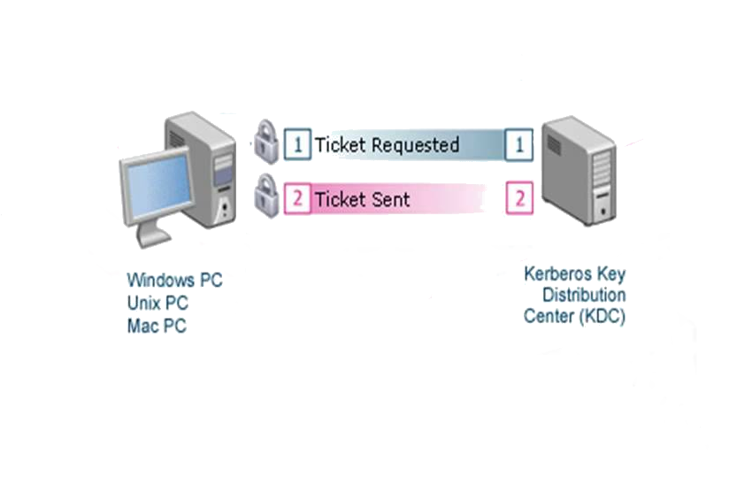
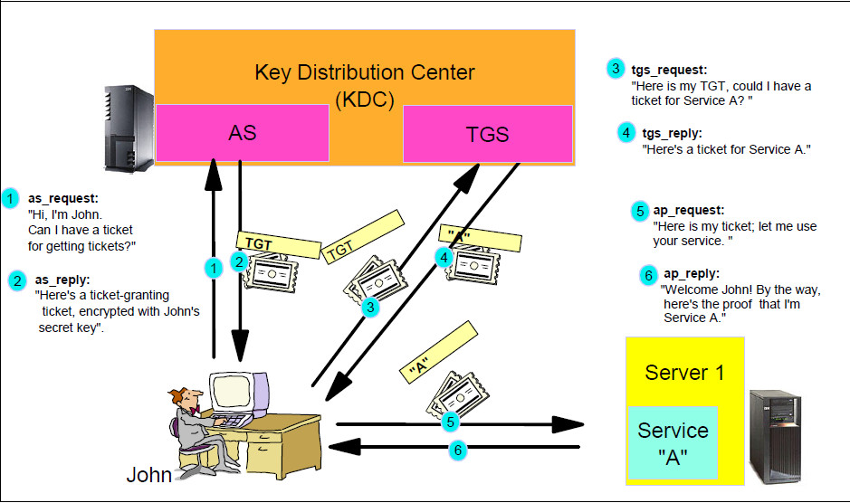
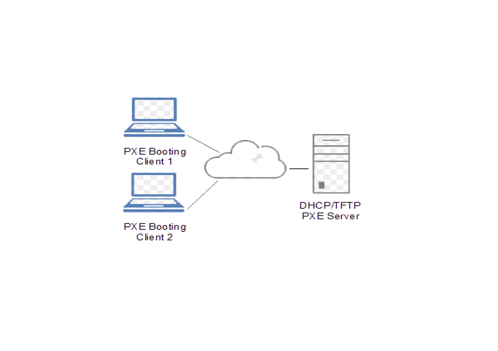

% Proyecto fin de ciclo
% Vladimir Remar
% 2018/05/22

---

# Gandhi Reload 

El objetivo de este proyecto es generar un modelo de acceso a servicios 
similar a los que brinda el servidor de  ***Gandhi*** en la escuela pero 
con cada uno de estos separados en contenedores Docker.

---

## Tecnologías: 

- [LDAP](#Servidor-LDAP)
- [NFS](#Servidor-NFS)
- [Kerberos](#Servidor-Kerberos)
- [DNS](#Servidor-DNS)
- [DHCP](#Servidor-DHCP)
- [SSH-Kerberized](#Servidor-SSH-Kerberized)
- [FTP-Kerberized](#Servidor-FTP-Kerberized)
- [HTTP-Kerberized](#Servidor-HTTP-Kerberized)
- [TFTP](#Servidor-TFTP)
- [Servidor PXE](#Servidor-PXE)
- [Docker-Compose](#Docker-compose)

---

## Servicios

¿Qué son los servicios básicos?

Son los servicios que permiten a un usuario de nuestra base de datos ldap
poder *trabajar* con normalidad.

¿Qué son los servicios Kerberizados?

Son aquellos servicios, tales como ftp, ssh o http entre otros puedan realizar
la autenticacíon via kerberos, es decir cuando un usuario necesita acceder
a un servicio de red, el cliente solicita un ticket y dependiendo de cada
servicio este lo valida contra la base de datos del servidor de Kerberos.

---

## [Servicios básicos de trabajo](#Servicios-básicos):

- Datos de los usuarios almacenados en un servidor ***Ldap***.
- El directorio de ficheros de cada usuario localizado en un servidor ***NFS***.
- Autenticación via ***Kerberos***.
- Implementación de un servidor de resolución de nombres(***DNS***) 
propio de la  estructura propia de *Gandhi reload*.
- Para el despliegue de toda nuestra red integraremos nuestro servidor de 
***DHCP***.

---

## [Servicios ***Kerberizados***](#Servicios-Kerberizados):
- FTP los usuarios podran disponer de sus propios ficheros como los 
proporcionados por el mismo servidor.
- SSH Se permitará el acceso a un sesión remota de los usuarios.
- HTTP Acceso a determinda web de nuestro servidor solo para los usuarios
validos del servidor LDAP.

## [Servicios extras](#Servicios-extras):

- Servidor TFTP.
- Servidor PXE.

---

## Atumatización via docker-compose

Todos estos servicios se implementarán en contendores Docker, por ello
haremos uso de un fichero [***docker-compose***](#Docker-compose) para 
automatizar tanto la creación como el arranque de nuestros servicios.

---

## Servidor LDAP

- Entrada Principal

		dn: dc=gandhi,dc=reload
		dc: gandhi
		description: Escola del treball de Barcelona
		objectClass: dcObject
		objectClass: organization
		o: gandhi.reload

- Entrada de la organizacion

		dn: ou=usuaris,dc=gandhi,dc=reload
		ou: usuaris
		description: Container per usuaris del sistema linux
		objectclass: organizationalunit

---

## Entrada para un usuario

		dn: uid=pau,ou=usuaris,dc=gandhi,dc=reload
		objectclass: posixAccount
		objectclass: inetOrgPerson
		cn: Pau Pou
		cn: Pauet Pou
		sn: Pou
		homephone: 555-222-2220
		mail: pau@gandhi.reload
		description: Watch out for this guy
		ou: Profes
		uid: pau
		uidNumber: 5000
		gidNumber: 100
		homeDirectory: /home/users/inf/pau
		userPassword: {SSHA}NDkipesNQqTFDgGJfyraLz/csZAIlk2/

---

## Servidor NFS

Dispondremos de un ***Volumne Docker*** ubicado en */mnt/dades* donde se 
creará la estructura de directorios para nuestros usuarios, en este caso 
su ***home***.

### Entradas 

		/mnt/dades/
		|-- 1asix
		|   |-- user01
		|   |-- user02
		|   |-- user03
		|   |-- user04
		|   `-- user05

		drwxr-xr-x. 2 user01  1asix 4096 May 19 12:37 user01
		drwxr-xr-x. 2 user02  1asix 4096 May 19 12:37 user02
		drwxr-xr-x. 2 user03  1asix 4096 May 19 12:37 user03
		drwxr-xr-x. 2 user04  1asix 4096 May 19 12:37 user04
		drwxr-xr-x. 2 user05  1asix 4096 May 19 12:37 user05

---

## Servidor Kerberos

---

## Servidor DNS

Se creara una zona ***gandhi.reload*** y se configura para que resuelva 
las ips de los servidores(ldap,nfs,kerberos, etc)	

	            IN  NS     e gandhi.reload.
	            IN  A       192.168.2.57
	ldap        IN  A       192.168.2.57
	krb         IN  A       192.168.2.57
	nfs         IN  A       192.168.2.57
	sshserver   IN  A       192.168.2.57
	ftpserver   IN  A       192.168.2.57
	tftpserver  IN  A       192.168.2.57
	httpserver  IN  A       192.168.2.57

---

## Servidor DHCP

Para este docker indagaremos en como trabaja las tecnologias de dockers con 
nuestras interficies de red para ello utilizaremos la ***network:host*** 
que es aquella que nos permite la utilización de todas las interficies 
de red del *host* anfitrión que gobierna los contenedores dockers.

	docker network ls
	NETWORK ID          NAME                DRIVER              SCOPE
	d875732dce9c        bridge              bridge              local
	8f9f00bc4aa6        gandhireload__net   bridge              local
	98a146d8dfb4        host                host                local
	49c5f64342c6        none                null                local

---

## Servidor de Administración Gadmin

Este Docker hará las funciones de administración de los servidores de 
ldap, nfs y kerberos.

Desarrollando tareas tales como:

- Añadir usuarios nuevos a nuestra base de datos de ldap.
- Gestionar los ***homes*** de los usuarios.
- Creará entradas de ***los principals*** en el servidor de kerberos.

---

## Servicios Kerberizados

---

## Desarrollo  

Cada uno de estos servicios se configurarán como si de un cliente se tratase,
es decir obtendran las configuraciones de nuestros servicios básicos para
luego ellos brindar acceso a los mismos de manera remota valiendose de la
autenticación via kerberos.

## Servidor SSH Kerberized

- Acceso a sessiones remota de los usuarios válidos.

## Servidor FTP Kerberized

- Acceso a los ficheros y directorios de los usuarios válidos.

## Servidor HTTP Kerberized

- Acceso a determinada web solo para usuarios válidos.

---

## Servicios extras

Conjuntamente con el servidor de DHCP configuramos el servidor de
TFTP y le damos la configuración para nuestro servidor de PXE.

---

## Docker Compose

Este mecanismo permite utilizar varias imágenes y comunicarlas, para 
obtener los requisitos necesarios para hacer funcionar nuestra estructura
de gestión.

	version: '3'
	services:
	  #LDAP
	  ldap:
	    build: 
	      context: $PWD/Documentacion/ModoBasico/ServerLdap/
	      dockerfile: Dockerfile
	    ports:
	     - "389:389"
	    networks: 
	      _net:
	        ipv4_address: 172.31.0.2
	    container_name: ldap.gandhi.reload
	    privileged: true
	    hostname: ldap.gandhi.reload

---

## Conclusiones

La idea de llevar determinados servicios a contendores dockers es algo 
que se debe hacer, si se hace, de manera progresiva para ver que servicios
son factibles de ser implementados y cuales no, es decir algunos de estos
servicios son facilmente extrapolables, tales como:

- Ldap
- Kerberos
- Todos los servicios Kerberizados

Y otros no tanto, como son:

- Nfs
- TFTP
- DhCP

---

## That's all folks

¿Alguna pregunta?

